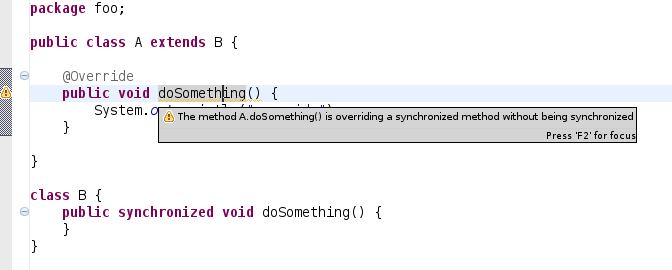

Project Lead: Benjamin Muskalla (IRC: benny\`work)

Mentor: Ahti Kitsik (IRC: ahtik)

This project is part of the [Google Summer of Code
2008](Google_Summer_of_Code_2008 "wikilink")

## Abstract

Prices of multi-core cpus are dropping and the move of multi-core
processors to desktop machines doesn't stand still. There is a growing
need of software developers to handle with concurrency-related problems
in their application in order to improve the scalability. Today Moore's
law is not applicable in the original sense as parallel computing
increases. This idea growed up out of these reasons. Todays developers
are all aware of the complexity of concurrent development but cannot
handle this complexity very well. In many cases it's not possible to
detect such problems with static or dynamic code analysis which implies
that developers need to take care of it. The main idea of this project
is not to solve concurrency problems but to help the developer to
concentrate on the real hard things and eliminate the machine-solvable
problems.

The whole proposal can be found
[here](http://dev.bmuskalla.net/gsoc/GSoC_ConcurrencyJDT.pdf) (pdf).

## Primary goals

**Legend**

 Needs some
investigation/research

 Work in
progress

 Bug fixed /
Feature added

#### Concurrency-aware refactorings

  -  **Inline
    synchronized method** - The "Inline method" refactoring currently
    ignores the `synchronized` modifier. See

#### Concurrency-related refactorings & quickfixes

##### Merge locks

One idea to improve the usability of refactorings in due consideration
of concurrency is to merge different synchronized blocks into one. In
the case the devel- oper sees that two synchronize blocks (with the same
lock) could be merged to one single block to avoid context switching.
This fits into the category of quick assists invoked by the user on
demand. I don't see a chance (at the moment) to detect such cases
without the knowledge of the dynamic behavior of the source passage
under stress. This is a typical case of what I meant in the
introduction. The developer has to decide about the real problem and JDT
should just help him to make the code clean as he want it to be.

##### Split/stripe locks

Splitting or striping locks helps to reduce the size of synchronized
blocks. Splitting the lock at an specific position should not be the
problem with this as long as the user provides informations where to
split it. Maybe it's possible with some research to come up with some
magic to have an automated partition of the lock depending on the static
analysis (at least for trivial code ows). I don't see \\the magic" as
something which should definitely be implemented but could be
continually improved.

##### Convert between lock types

Everything is fine with the usage of the synchronized statement. But
projects are more and more migrat- ing to J2SE 5 where new
synchronization mechanisms are available. As those should only be used
if there is a need for the advanced features of eg. Reentrant- Lock
there is no anchor for a compiler warning or error. But we should
consider to help the developer by providing quick assists to transform
the code be- tween different synchronization styles. An example is the
convert between a synchronized block/method and the usage of a
ReentrantLock. This would help the developer to not care about stuff
like releasing the lock in a finally block as this can be done by the
quick assist.

##### Introduce lock

Maybe the definition is a bit too vague - that goal is not to find
concurrency problems and introduce a new lock or something like that.
The usecase here is rather simple. When we have cases where a lock is
needed due to a compile error like passing null as lock to a synchronize
statement, this refactoring has it's big coming out. It should be very
similar to the \\Introduce field" quick fix with some slight
modifications like a better guessed name, private and final modifiers,
initiating a new Object directly. These are just some ideas which apply
to my coding style but need to be discussed again with a broader
audience.

#### New compiler warnings

  -  Avoid
    non-final locks
  -  Lock not
    released in all paths
  -  Usage of
    volatile arrays
  -  Avoid
    global locks

## Available features

### Milestone 1

Here we will list all the features which are currently available in the
plugin.

{{| style="width:75%; |- valign="top" | **Compile warnings for non-final
locks** || Many developers have the need that every lock should be final
to not change the lock inside the synchronized block. The plugins adds a
new compiler warning which checks every used lock of synchronized
statements wether they are final.

In order to quickly fix this warning, a new quickfix was introduced to
react to this warning in order to turn the field into a final field.

|- valign="top" | **Compile warnings for volatile arrays** || Declaring
an array field as volatile does not ensure visibility of its elements.
Volatility cannot be manually propagated for arrays because array
elements themselves cannot be declared as volatile.

|- valign="top" | **Quick fix for null mutex** || It happens from time
to time that we insert null as mutex for a synchronized block which is
not possible. JDT already marks this as error as you can see in the
first screenshot.

In order to quickly fix this error, a new quickfix was introduced to
introduce a new lock.

|}}

### Milestone 2

{{| style="width:75%; |- valign="top" | **Preference page for problem
severities** || As everyone has it's own style of development or is only
interested in some of the compile checks, there is now a preference page
which let's you decide if you want to see the problems as warnings or as
errors. You can even disable the checks completely.

|- valign="top" | **Avoid global locks** || Locking on global objects
like Strings (internal sharing of JVMs) or `Boolean.TRUE` /
`Boolean.FALSE` can lead to deadlock situations between unrelated code
blocks. We introduced several compile errors for these cases. See also
this well-known [bug](http://jira.codehaus.org/browse/JETTY-352) of
Jetty.

|}}

### Milestone 3

{{| style="width:75%; |- valign="top" | **Inlining synchronized
methods** || JDT does a great job with providing the "Inline method"
refactoring. There is just one major issue that synchronization is
completely ignored. In order to fix this, I'm working on a patch for the
"Inline method" refactoring which allows you to inline synchronized
methods and still having the proper synchronization in place. This will
be availabe in one of the next builds of JDT after the patch is accepted
(see
[bug 112100](https://bugs.eclipse.org/bugs/show_bug.cgi?id=112100)).

Having a class like the following and inlining the method
`doSomethingWithLocks` now correctly synchronized the inlined
statements.

And the result:

|- valign="top" | **Warning for overriding synchronized methods without
sychronization** || It can happen easily that one overrides a method
which is synchronized without synchronizing itself. This is not needed
in every case but often appears to be a fault source. In one of the next
builds, JDT/Core has a new compile warning for these cases. See also the
[corresponding
bug](https://bugs.eclipse.org/bugs/show_bug.cgi?id=239066) for more
informations.

|}}

### Milestone 4

{{| style="width:75%; |- valign="top" | **Convert between lock types**
|| With the addition of the `java.util.concurrent` package in Java 1.5
you're now able to use other types of locks then the built-in
`synchronized` statement. In order to quickly convert your synchronized
statement to a ReentrantLock (which is essentially the same), we will
now provide a quick fix for this. But please use the ReentrantLock only
if you really need it's additional features which are not available with
the `synchronized` statement.

The initial source code:

Invoking the quick assist:

And the end result:

 |}}

### Milestone 5

## Download

In order to have community feedback this project will release a new
update site for every release. It consists of a set of plugins which
extend JDT with new features. There is no need to crazy patchin' you
current installation - just add the update site to your P2 installer and
install it.

Requirements: \> Eclipse SDK 3.4 with JDT

Update Site: <http://dev.bmuskalla.net/stable/>

## Timeline

Here is a complete list of the milestones and release candidates planned
for this plugin.

{{| class="wikitable" style="text-align:center" |-
style="background:\#efefef;" \! Milestone \!\! Date \!\! Planned items
|- style="background:lightgrey;" \! M1 | June 16 |align="left"| Avoid
non-final locks, Usage of volatile arrays, Introduce lock |-
style="background:lightgrey;" \! M2 | June 28 |align="left"| Lock not
released in all paths, Avoid global locks |-
style="background:lightgrey;" \! M3 | July 15 |align="left"|Inline
synchronized method, Debugging concurrency problems, Convert between
lock types |- style="background:lightgrey;" \! M4 | July 26
|align="left"| Merge locks, Split/stripe locks |-
style="background:lightgrey;" \! M5 | July 31 |align="left"| bug fixing,
community suggestions |- style="background:lightgrey;" \! RC1 | August 4
|align="left"| critical bugs, documentation |-
style="background:lightgrey;" \! RC2 | August 8 |align="left"|
documentation |- style="background:lightgrey;" \! Pencils down | August
11 |align="left"| - |}}

## Community Involvement

### Getting the source

In order to have a look at the actual source code of the plugin you can
use the [team project set](http://wiki.eclipse.org/Image:Jdtc.psf) to
import all relevant sources. Be sure to have Eclipse 3.4RC2 at least in
order to compile the code. Here is a short list of the involved plugins:

  - org.eclipse.gsoc.concurrency.core - core infrastructure, compile
    warnings/errors, usable in a headless way
  - org.eclipse.gsoc.concurrency.core.tests - tests for the compile
    warnings
  - org.eclipse.gsoc.concurrency.ui - ui-relevent elements as quick
    fixes and refactorings
  - org.eclipse.gsoc.concurrency.ui.tests - tests for all quick fixes
    and refactorings

### Open issues

To see all the open issues and feature requests of this project, take a
look at [this
query](https://bugs.eclipse.org/bugs/buglist.cgi?query_format=advanced&short_desc_type=allwordssubstr&short_desc=JDTC&classification=Technology&product=SOC&long_desc_type=allwordssubstr&long_desc=&bug_file_loc_type=allwordssubstr&bug_file_loc=&status_whiteboard_type=allwordssubstr&status_whiteboard=&keywords_type=allwords&keywords=&bug_status=UNCONFIRMED&bug_status=NEW&bug_status=ASSIGNED&bug_status=REOPENED&emailtype1=substring&email1=&emailtype2=substring&email2=&bugidtype=include&bug_id=&votes=&chfieldfrom=&chfieldto=Now&chfieldvalue=&cmdtype=doit&order=Reuse+same+sort+as+last+time&field0-0-0=noop&type0-0-0=noop&value0-0-0=).

### New ideas

Do you have a great idea for a refactoring, quick fix or compiler
warning regarding concurrency issues? Just open a [new feature
request](https://bugs.eclipse.org/bugs/enter_bug.cgi?product=SOC)
against the SOC component and prefix it with \[jdtc\].

[Category:SOC](Category:SOC "wikilink")
[Category:JDT](Category:JDT "wikilink")